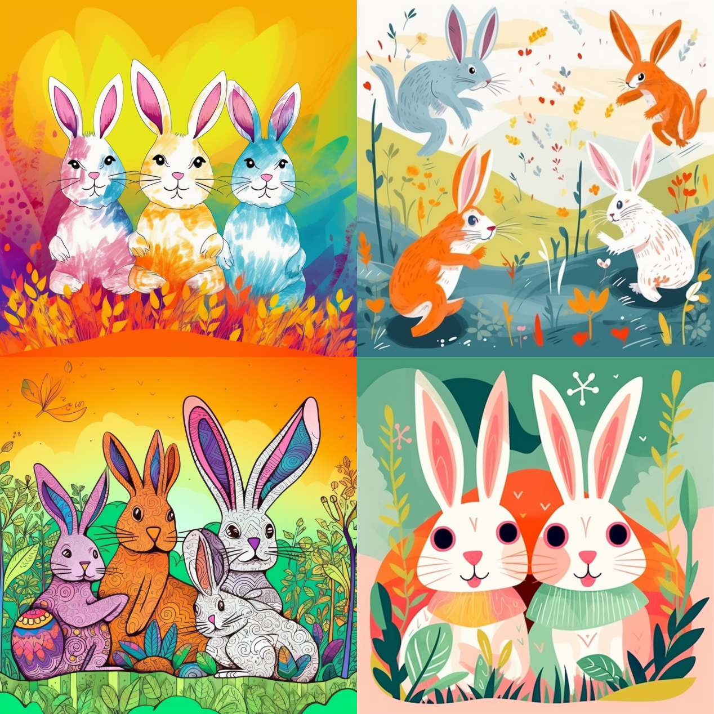

# A Reference Client App

<figure><figcaption></figcaption></figure>

We continuously deploying our first party reference client app to interact with The Greeting protocol on [https://greeting.network](https://greeting.network).

### Promoting Serendipity (Under Development)

There are two types of novelty in promoting serendipity. One is that the recipient no longer finds it annoying because they receive a benefit, and the other is that there will be more opportunities to share a common understanding that now is the time to greet, as with traditional New Year's greeting cards. As a result, there will simply be more appropriate opportunities to initiate new contact, which used to rely on New Year's greeting cards, leading to the promotion of serendipity.

Another way to promote serendipity is by using the open greeting graph data. For example, when A and B, A and C, B and C, B and D, and C and D exchange greetings, the application can suggest to A that they might want to greet D, who may be an acquaintance. Whether or not the greeting words mentioned earlier match can also be a useful trigger and can be combined. There is novelty in how the opportunity to greet is presented. People often want a reason or excuse to take action, so if the system can automatically generate the content of the greeting and all the user has to do is press the send button, it may lower the barrier to sending greetings. This would make it easier for users to build new relationships and increase connections with people in areas they are interested in.

### AI Support (Under Development)

<figure><figcaption>
Generated by Midjourney v5
</figcaption></figure>

With the adoption of the SBT standard, users can set public text and images separately from the private ones. However, this could increase the effort required and move away from the goal of making the process simple and easy. To address this, it is proposed to use AI generation technologies such as Midjourney or OpenAI's GPT in client applications to automatically generate appropriate and inoffensive public text and images based on the private content.

In the long run, it is believed that using AI-generated images for private purposes as well would make the process more accessible and convenient. For example, an automatically generated image using Midjourney with a prompt tailored to the theme of the Year of the Rabbit is shown in the above figure. By leveraging AI support, the overall user experience of sending and receiving greetings can be significantly improved, making it a more seamless and enjoyable process for users.
